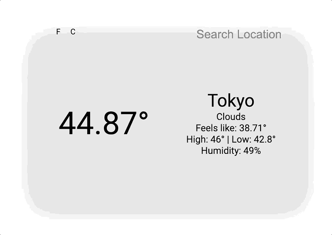

# Weather App

[Live Demo](https://taylorjonestrt.github.io/weather-app/)

For my first project to utilize using an API I created a weather app that will grab your locations (or any locations) current weather details (Current temperature, what it actually feels like outside, a description and more). While creating this project I learned how to implement async/await into my code so that I could have an asynchronous app while also avoiding callback hell. 

The app is written in vanilla Javascript, HTML, and CSS using Webpack and file modules to keep the code clean and readable. ES6 Classes are used where they could be to help keep code to an OOP style as much as possible.

The app uses the free api provided by [OpenWeatherMap](https://openweathermap.org/)

While building the web app I focused on having every function/method be aligned with the single-responsibility principle as much as possible (may have been able to do it in other places as well, if I missed any open an issue to point it out!).

